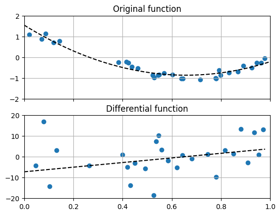

# 데이터를 미분하기

여기서는 데이터를 미분한 것과 데이터를 피팅한 후 미분한 것을 비교하도록 합니다.

- 실습 파일: [`03_analysis/03_data_differential.py`](https://github.com/CNU-Computer-Physics/Example-and-Practice/blob/main/03_analysis/03_data_differential.py)

## 프로그래밍

### 데이터 읽어들이기

이전 데이터 피팅에서 사용했던 `input.csv`파일을 그대로 사용합니다. 내용은 아래와 같이 공백으로 구분한 두 실수입니다.

```txt
0.0202184 1.0819082
0.07103606 0.87027612
0.0871293 1.14386208
0.11827443 0.70322051
...         ...
```

이 파일을 읽어들여 `x`, `y`의 두 실수 리스트를 만들게 됩니다.

```python
x = []
y = []

with open("input.csv", "r") as f:
    for line in f.readlines():
        _x, _y = [float(i) for i in line.split(" ")]
        x.append(_x)
        y.append(_y)
```

### 데이터의 미분

함수의 미분과 같은 방식으로 데이터 미분을 수행합니다.

```python
def g(x, y):
    new_x = []
    new_y = []
    for idx in range(len(x) - 1):
        new_x.append((x[idx] + x[idx + 1]) / 2)
        new_y.append((y[idx + 1] - y[idx]) / (x[idx + 1] - x[idx]))
    return new_x, new_y
```

함수는 아래의 수식과 같은 기능을 합니다.

$$ y_i = \frac {f(x_{i+1}) - f(x_i)} { x_{i+1} - x_i } $$

$$ x_i = \frac {x_{i+1} + x_i} {2} $$

### 데이터를 피팅하고 미분

```python
# 2차함수로 피팅한 x와 y
fit = np.poly1d(np.polyfit(x, y, 2))
fit_x = np.linspace(0, 1)[:-1]
fit_y = np.diff(fit(fit_x))
```

`np.diff()`는 배열의 한 축을 정하고 그 축을 따라 변화량을 계산해서 새로운 배열로 돌려줍니다. 1차원 배열이 들어간 경우 순서상으로 이웃한 두 값 사이의 변화량을 출력하며 배열의 크기는 하나 줄어들게 됩니다.

## 결과



앞서 다뤘던 함수의 도함수를 계산하는 요령으로 데이터의 미분량을 구하는 함수가 `g()`입니다. 그래프에는 점으로 표현되어 있는 값입니다.

이와는 별도로 데이터 피팅을 우선 수행하여 `fit_x`와 `fit_y`로도 계산하여 그래프에 검정색 실선으로 표시하였습니다.

우리가 현상이나 특성의 모델을 세우고 이를 확인하고자 할 때 도움이 되는 방법은 무엇일까요?
