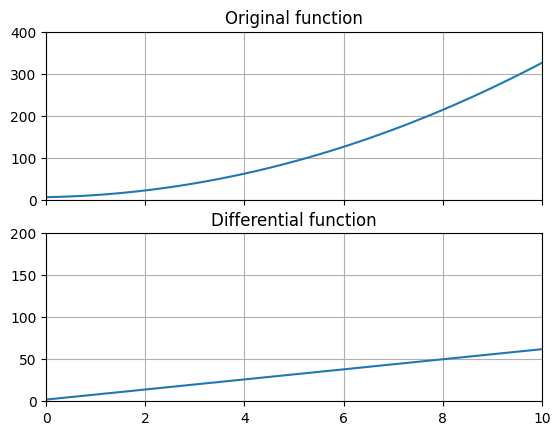
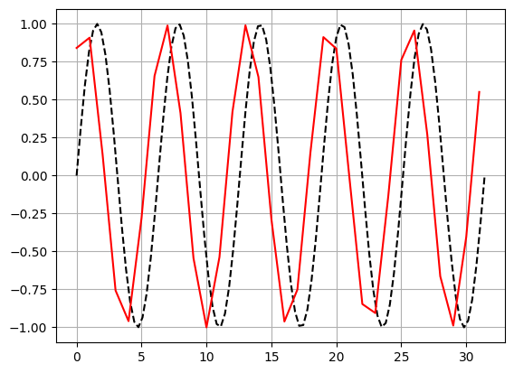

# 함수를 미분하기



함수$ f(x) $를 미분하는 경우 아래의 과정을 거치게 됩니다.

$$ f'(x) = \lim _{\Delta x \to 0} \frac {f(x + \Delta x) - f(x)} { \Delta x } $$

그러나 컴퓨터는 무한소 개념을 이해 할 수 없으므로 충분히 작은 값 $ h $를 도입합니다. 수학적으로 엄밀하지 않고 오차가 발생하겠지만 수치를 다룰 때 신경쓰이지 않을 정도로 작은 오차를 낼수 있는 충분히 작은 $ h $를 사용한다면 큰 문제없이 수치해석에 사용할 수 있습니다.

$$ f'(x) = \frac {f(x + h) - f(x)} { h }, h \ll 1 $$

## 도함수 만들기

- 실습 파일: [`03_analysis/02A_function_differential.py`](https://github.com/CNU-Computer-Physics/Example-and-Practice/blob/main/03_analysis/02A_function_differential.py)

### 원함수

```python
def f(x):
    return np.sin(x)
```

도함수를 구할 원함수 $ \sin x $입니다.

### 미분 함수

```python
def g(func, xmin, xmax, h=0.01):
    x = np.arange(xmin, xmax, h)
    y = []
    y0 = func(xmin)
    for _x in x:
        y0 += func(_x + h) - func(_x)
        y.append(y0)
    return x, np.array(y)
```

원함수 `func`와 $ x $의 시작값인 `xmin`, $ x $의 끝값인 `xmax`, 미분 간격 `h`을 입력받아 미분한 함수값들을 출력합니다.

$$ f'(x) = \frac {f(x + h) - f(x)} { h } $$

식의 파이썬 표현입니다.

### 그래프 그리기

```python
x = np.linspace(0, np.pi * 10, 100)
plt.plot(x, f(x), "k--")
plt.plot(*g(f, 0, np.pi * 10, h), "r")
plt.grid(True)
plt.show()
```

`plt.plot()`의 세 번째 매개변수인 `"k--"`는 검정색(`k`), 점선(`--`)을 의미하는 약식 속성입니다. `plt.grid(True)`를 통해 그래프에 보조 격자선을 표시할 수 있습니다.

## 컴퓨터로 계산한 도함수의 오차

- 실습 파일: [`03_analysis/02B_function_differential.py`](https://github.com/CNU-Computer-Physics/Example-and-Practice/blob/main/03_analysis/02B_function_differential.py)



이 프로그램은 도함수를 사용해서 원래 함수와 같은 값을 출력하도록 만든 것입니다.

$$ f(x_{i}) = f(x_{i-1}) + h f'(x_{i}) $$

즉,

$$ f(x_{i}) = f(x_{i-1}) + f(x_{i} + h) - f(x_{i}) $$

이 됩니다.

위의 예제를 실행해 보고 `h`의 크기에 따라 오차가 어떻게 변하는지 살펴봅시다.

```python
def g(func, xmin, xmax, h=0.01):
    x = np.arange(xmin, xmax, h)
    y = []
    y0 = func(xmin)
    for _x in x:
        y0 += func(_x + h) - func(_x)
        y.append(y0)
    return x, np.array(y)
```

검증함수 `g(func, xmin, xmax, h)`는 각각 함수 `func`, 시작값 `xmin`, 끝나는 값 `xmax`, 데이터 간격 `h`를 입력을 받아 데이터 배열 `x`와 `y`를 출력합니다. 함수의 매개변수 표현 중 `h=0.01`이 있습니다. 이것은 "h값 입력을 생략했다면 h의 값으로 0.01을 사용한다"는 뜻입니다.

정해진 간격 `h`를 두고 `xmin`부터 `xmax`에 이르는 배열을 얻기 위해 `np.arange(xmin, xmax, h)`를 사용합니다.

```python
plt.plot(x, f(x), "k--")
plt.plot(*g(f, 0, np.pi * 10, h), "r")
```

`plt.plot`의 세 번째 옵션인 `"k--"`는 검은색(`k`) 점선(`--`)으로 표시하라는 의미를 가지고 있습니다. `"r"`은 빨강(`r`)색으로 바꾸고 나머지는 기본값으로 표시하라는 의미를 가집니다.

예제는 특수한 매개변수 전달 방식으로 `*g(f, 0, np.pi * 10, h)`을 사용하고 있습니다. 이것은 풀기(unpack)라는 사용방법이며 묶여있는 상태의 매개변수들을 풀어서 대입할 수 있도록 합니다.
