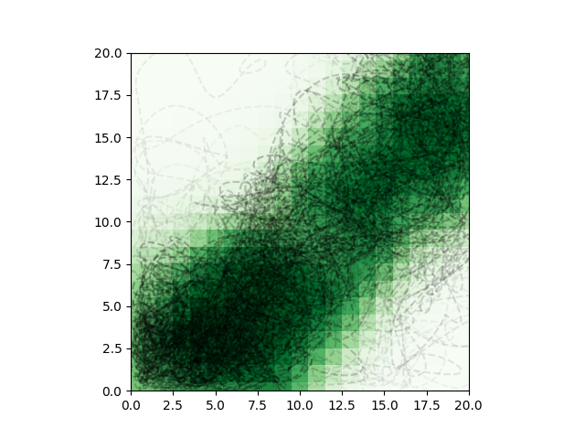

# 개미집단 최적화



개미집단 최적화(Ant colony optimization)는 개미가 먹이와 집의 경로를 찾는 과정을 흉내내어 최적의 경로를 찾아내는 최적화 기법입니다. 이런 경우에 유용하게 사용할 수 있습니다.

- 답이 하나가 아닌 경우
- 답이 여러개일 가능성이 있는 경우

해결할 수 있는 문제의 특징은 이렇습니다.

- 출발지와 목적지가 있음(혹은 출발지로 되돌아옴)
- 출발지와 도착지 사이에는 경로가 존재함
- 노드와 경로의 수는 유한하며 이미 알고 있음

여기서는 사각형 격자 공간에서 시작과 골 지점이 있는 상황을 두고 개미집단 최적화를 사용합니다.

- 실습 파일: [`05_optimization/01_ant_colony.py`](https://github.com/CNU-Computer-Physics/Example-and-Practice/blob/main/05_optimization/01_ant_colony.py)

## 프로그램 구조

```python
import matplotlib.pyplot as plt
import numpy as np

area = np.ones([20, 20])  # 지역 생성
start = (1, 1)  # 개미 출발지점
goal = (19, 14)  # 도착해야 하는 지점
path_count = 40  # 경로를 만들 개미 수
path_max_len = 20 * 20  # 최대 경로 길이

pheromone = 1.0  # 페로몬 가산치
volatility = 0.3  # 스탭 당 페로몬 휘발율


def get_neighbors(x, y):
    """x, y와 이웃한 좌표 목록 출력"""

def ant_path_finding():
    """개미 경로 생성"""

def step_end(path):
    """경로를 따라 페로몬을 더하고 전 지역의 페로몬을 한번 휘발시킴"""

if __name__ == "__main__":
  # 계산 및 그래프 작성
```

## 이웃한 좌표 찾기

```python
def get_neighbors(x, y):
    """x, y와 이웃한 좌표 목록 출력"""
    max_x, max_y = area.shape
    return [
        (i, j)
        for i in range(x - 1, x + 2)
        for j in range(y - 1, y + 2)
        if (i != x or j != y) and (i >= 0 and j >= 0) and (i < max_x and j < max_y)
    ]
```

현재 타일 좌표를 `x`, `y`로 받아 상하좌우와 대간선 방향까지 감안한(8방향) 이웃 타일들의 좌표를 출력합니다.

## 개미 경로 생성

```python
def ant_path_finding():
    """개미 경로 생성"""
    path = [start]
    x, y = start
    count = 0
    while x != goal[0] or y != goal[1]:
        count += 1
        if count > 400:
            return None
        neighbors = get_neighbors(x, y)
        values = np.array([area[i, j] for i, j in neighbors])
        p = values / np.sum(values)
        x, y = neighbors[np.random.choice(len(neighbors), p=p)]
        while (x, y) == path[-1]:
            x, y = neighbors[np.random.choice(len(neighbors), p=p)]
        path.append((x, y))
    return path
```

개미 한 마리가 페로몬의 농도로 보정한 확률 공간에 따라 8방향 중 하나를 골라 이동합니다. 400번 이동할 때까지 골 지점에 도착하지 못하면 이동을 포기합니다.

## 지역 페로몬 업데이트

```python
def step_end(path):
    """경로를 따라 페로몬을 더하고 전 지역의 페로몬을 한번 휘발시킴"""
    global area
    if path is None:
        return
    for x, y in set(path):
        area[x, y] += pheromone / len(set(path))
    area[:, :] = area * (1 - volatility)
    return
```

골 지점에 성공적으로 도착한 개미의 경로를 따라 페로몬을 더하고 타일 전체의 페로몬을 정해진 비율로 휘발시킵니다.

## 더 멋지게 만들기

이런 아이디어를 추가하면 더 멋진 결과를 얻을 수 있습니다.

- [B-스플라인 곡선](https://docs.scipy.org/doc/scipy/reference/generated/scipy.interpolate.splrep.html?highlight=splrep#scipy.interpolate.splrep)을 사용해서 개미의 경로를 부드럽게 만들어 줄 수 있습니다. 당장의 계산 결에는 영향을 미치지 않겠지만 실제 개미의 움직임에 더 가까운 그래프를 얻을 수 있습니다.
- [가우시안 필터](https://docs.scipy.org/doc/scipy/reference/generated/scipy.ndimage.gaussian_filter.html)를 사용해서 페로몬이 이웃한 지역으로 부드럽게 확산되는 것을 계산에 추가할 수 있습니다. 경로가 고정되는 것을 조금 더 효율적으로 늦춰줄 수 있습니다.
- 예제는 주어진 횟수만큼 반복했지만 조건부 반복(`while`)을 사용해서 경로가 충분히 고정되었거나 페로몬의 변화가 충분히 적을 때 계산을 종료하도록 만들 수 있습니다.

이외에도 생각나는게 있다면 직접 프로그램을 수정해서 더 멋진 결과를 얻어 봅시다.
