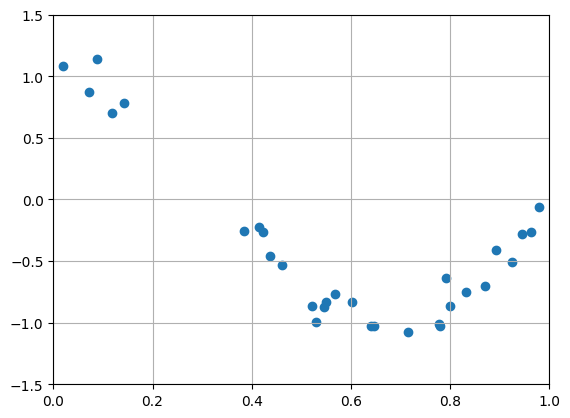

# 데이터 파일을 그래프로

`input.csv`파일의 내용은 아래와 같이 공백으로 구분한 두 실수로 작성되어 있습니다. 이 파일의 첫 번째 열은 x값 두 번째 값은 y값이라고 약속했을 때 이 데이터를 그래프로 그리려고 합니다.

```txt
0.0202184 1.0819082
0.07103606 0.87027612
0.0871293 1.14386208
0.11827443 0.70322051
...         ...
```

## 예제 소스코드

```python
import matplotlib.pyplot as plt

x = []
y = []

with open("input.csv", "r") as f:
    for line in f.readlines():
        items = line.split(" ")
        x.append(float(items[0]))
        y.append(float(items[1]))

if __name__ == "__main__":
    plt.scatter(x, y)
    plt.xlim(0, 5)
    plt.ylim(0, 30)
    plt.grid(True)
    plt.show()
```



이 프로그램은 프로그램과 동일한 디렉토리에 위치한 파일 `input.txt`를 열어 데이터를 추출한 뒤 추출한 데이터를 그래프로 표시합니다.

```txt
0.0202184 1.0819082
0.07103606 0.87027612
0.0871293 1.14386208
0.11827443 0.70322051
0.14335329 0.78494746
...
```

데이터는 이렇게 각 행마다 공백으로 x와 y를 구분하는 형태입니다.

## 파일 불러오기

```py
x = []
y = []

with open("input.csv", "r") as f:
    for line in f.readlines():
        items = line.split(" ")
        x.append(float(items[0]))
        y.append(float(items[1]))

```

`with open({파일}, {모드}) as {더미}:`는 파일을 열어서 사용하기 위한 문법입니다. {파일}을 {모드}로 읽어서 {더미}에 변수로 저장합니다. 즉, 위의 예시에서는 `input.csv`를 읽기(`r`)모드로 변수 f에 저장합니다.

`f.readlines()`는 파일 내용을 한줄씩 문자열로 읽어 리스트형 변수로 만듭니다. 각 문자열(`line`)을 공백을 기준으로 분할하고 각각을 `x`변수와 `y`변수에 추가(`append()`)합니다. 문자열을 수치로 받아들일 수 있도록 `float()`를 사용하여 변수의 자료형을 변경합니다.


## 그래프로 그리기

```py
import matplotlib.pyplot as plt

if __name__ == "__main__":
    plt.scatter(x, y)
    plt.xlim(0, 5)
    
    plt.ylim(0, 30)
    plt.grid(True)
    plt.show()
```

`plt.scatter(x, y)`는 분산형 그래프를 그리는 함수입니다.

`plt.xlim(min, max)`과 `plt.ylim(min, max)`은 각 축의 최소값과 최대값을 지정합니다.
