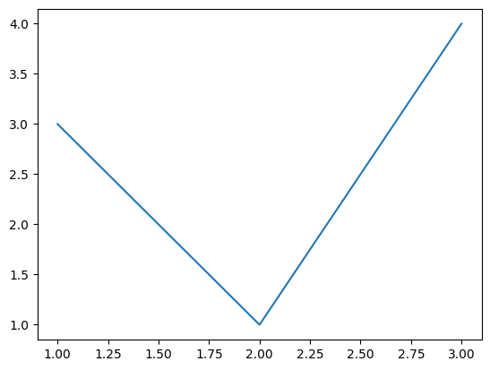

# 그래프 그리기

[matplotlib](https://matplotlib.org/)은 파이썬을 위한 시각화 도구입니다. 각종 그래프와 그림, 다이얼로그등을 다루는 것을 목적으로 합니다.

## matplotlib 설치하기

앞으로의 실습에 필요한 `matplotlib`과 `numpy`를 설치합니다.

PIP 설치

```bash
python3 -m pip install matplotlib numpy
```

아나콘다(Anaconda) 설치: 보통은 기본으로 설치되어 있습니다.

```bash
conda install matplotlib numpy
```

리눅스 설치

```bash
sudo apt install python3-matplotlib python3-numpy
```

## pyplot

`matplotlib`는 너무 복잡한 모듈과 설정을 가지고 있어서 수업에는 쉽고 단순한 인터페이스를 제공하는 `pyplot`모듈을 이용합니다.

```python
import matplotlib.pyplot as plt

x = [1, 2, 3]
y = [3, 1, 4]
plt.plot(x, y)
plt.show()
```


