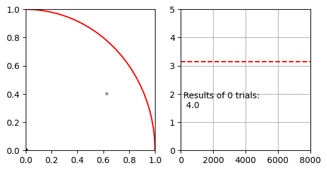
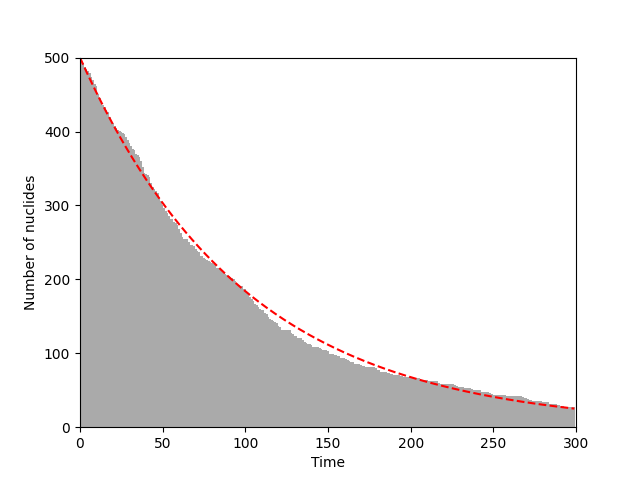
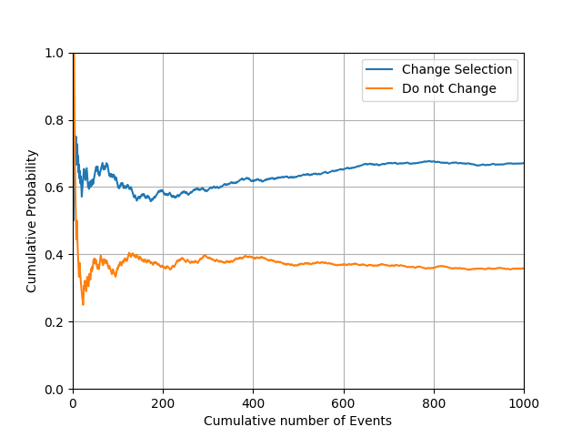

# 몬테카를로 방법

몬테카를로 방법은 난수(무작위로 뽑은 수)를 활용하여 누적되는 결과값을 모아 결과의 분포를 계산하거나 복잡한 함수의 값을 계산하는데 쓰입니다.

## 파이 근사하기



몬테카를로 적분을 이용해 $\pi$를 구하는 방법입니다. 이 방법은 유한한 공간에서 난수로 생성한 점이 적분할 공간 안에 있는지 밖에 있는지 확인 할 수 있는 경우에 사용할 수 있습니다.

먼저 $x=[0, 1], y=[0,1]$인 공간이 있습니다. 이 공간에 중심이 $(0, 0)$이고 반지름이 $1$인 사분원이 있습니다. 사분원과 사각형의 넓이 비율은 $ \pi r^2 / 4 r^2 $ 이므로 반지름 1인 사분원과 한 변이 1인 직사각형의 비율은 $ \pi / 4 $가 됩니다.

몬테카를로 적분은 난수로 생성한 점 $(x, y)$이 $ x^2 + y^2 < 1 $을 만족하면 사분원 안에 있는 것으로 판단하여, 전체 생성한 난수 점(정사각형의 넓이)과 사분원 내의 난수 점(사분원의 넓이)의 비율로 $\pi$를 추정합니다.

- 실습 파일: [`04_simulation/04A_monte_carlo.py`](https://github.com/CNU-Computer-Physics/Example-and-Practice/blob/main/04_simulation/04A_monte_carlo.py)

```python
import numpy as np

count_lim = 8001

points = np.zeros([count_lim, 2])
calc_pi = np.zeros([count_lim, 2])
result_pi = 0.0
inner = 0
for count in range(count_lim):
    points[count, :] = pos = np.random.rand(2)
    if np.sum(pos ** 2) < 1:
        inner += 1
    result_pi = 4 * inner / (count + 1)
    calc_pi[count, :] = count + 1, result_pi
    if count % 100 == 0:
        print(f"Monte carlo progress: {count} / {count_lim}")
```

## 방사성 붕괴

특정한 단위시간당 붕괴 확률을 가진 입자들이 모여있을 때 전체 핵종의 수가 어떻게 변화하는지를 몬테카를로 방법으로 추정합니다.

- 실습 파일: [`04_simulation/04B_monte_carlo.py`](https://github.com/CNU-Computer-Physics/Example-and-Practice/blob/main/04_simulation/04B_monte_carlo.py)

```python
import numpy as np

def decay_event(nuclides, probability):
    """붕괴 단일 이벤트"""
    func = lambda x: 1 if np.random.rand() > probability and x > 0 else 0
    return np.vectorize(func)(nuclides)
```

`np.ones()`로 초기화한 배열을 다룬다는 가정을 두고 맵핑(mapping)이라는 방법을 사용하여 각 입자에 독립적인 확률로 붕괴하도록 하는 사건을 적용합니다. 일반 함수 `func()`를 람다식 문법으로 생성한 후 이를 `numpy.array`를 위한 맵핑 함수로 변경하기 위해 `np.vectorize(func)`를 씁니다.

`np.vectorize(func)`의 결과 또란 함수이므로 괄호를 붙여 이벤트를 적용할 배열을 매개변수로 전달하기 때문에 `np.vectorize(func)(nuclides)`처럼 괄호가 연달아 나오는 생소한 문법이 되었지만 잘 작동합니다.

```python
import matplotlib.pyplot as plt
import numpy as np

nuclides_n = 500  # 핵종의 수
probability = 0.01  # 단위시간당 붕괴 확률
time_max = 300  # 관측 시간


nuclides = np.ones(nuclides_n)
x = np.arange(time_max)
y = []
for i in x:
    y.append(np.sum(nuclides))
    nuclides = decay_event(nuclides, probability)
plt.bar(x, y, 1, color="#AAA")
plt.plot(x, nuclides_n * np.exp(-probability * x), "r--")
plt.xlabel("Time")
plt.ylabel("Number of nuclides")
plt.xlim(0, time_max)
plt.ylim(0, nuclides_n)
plt.show()
```



이벤트를 반복하고 결과를 그래프로 출력하는 부분입니다.

`nuclides` 변수는 `np.ones()`로 초기화한 배열이 들어 있으며, 이렇게 생성한 배열은 원소의 값이 모두 1로 채워져 있습니다. 즉, 핵종이 붕괴했으면 원소의 값이 0, 붕괴하지 않았으면 원소의 값이 1을 가지도록 구현하였습니다. 이러한 구현은 나중에 남은 원소의 수를  구하려고 할 때 `np.sum()`을 사용해서 간단하게 구할 수 있으므로 유용합니다.

매 시간마다 남은 원소의 수와 함께 이론적으로 유도한 방사성 붕괴 공식 $ N(t) = N(0) e^{-\lambda t} $을 빨간 점선으로 표시하였습니다. 독립적인 붕괴 확률에 따라 붕괴 하는 핵종들의 수가 수학적으로 유도한 수식과 잘 맞는 것을 볼 수 있습니다.

## 몬티 홀 문제

참가자는 세개의 문 중에 하나를 선택하여 문 뒤에 숨겨진 선물을 획득할 수 있습니다. 셋 중 하나의 문 뒤에는 자동차가 있고 나머지 두 개의 문에는 염소가 있습니다. 이 때 참가자가 자동차가 숨겨진 문을 선택할 확률은 1/3일 것입니다. 그런데 여기서 사회자는 염소가 들어있는 하나의 문을 열어서 보여주고 선택을 바꿀것인지 묻습니다. 선택을 바꾸거나 바꾸지 않아도 참가자가 자동차를 뽑을은 1/2일까요?

- 실습 파일: [`04_simulation/04C_monte_carlo.py`](https://github.com/CNU-Computer-Physics/Example-and-Practice/blob/main/04_simulation/04C_monte_carlo.py)

```python
import numpy as np

count = 1000  # 시행 수
doors = ["A", "B", "C"]  # 문

def monty_hall(count, doors, has_change=True):
    player = np.zeros(count)
    for idx in range(count):
        car = np.random.choice(doors)
        # 첫 번째 선택
        choice = np.random.choice(doors)

        # 사회자가 염소를 보여줌
        goats = doors.copy()
        goats.remove(car)
        try:
            goats.remove(choice)
        except:
            pass
        show = np.random.choice(goats)
        selection = doors.copy()
        selection.remove(show)

        # 선택을 변경할지 말지 결정
        if has_change:
            selection.remove(choice)
            last = np.random.choice(selection)
        else:
            last = choice
        print(
            f'{idx: 4d} Show [{"Success" if last == car else " Failed"}]: '
            f'choice "{choice}", Show goat "{show}", Car in "{car}"'
        )
        player[idx] = 1 if last == car else 0
    return player
```



X축은 누적 시행 횟수, Y축은 누적 상품 획득률입니다. 시행횟수가 증가할수록 특정 수치에 수렴하는 것을 볼 수 있습니다.

재미있게도 중간에 사회자가 개입했을 뿐 최종 선택은 그저 1/2의 확률 문제인줄 알았던 게임이었는데, 오히려 선택을 바꾸느냐 아니냐에 따라 확률이 바뀌고 선택을 바꾸는 것이 오히려 유리한 것을 볼 수 있습니다.

여기서 소개한 몬티 홀 문제(Monty Hall problem)는 베이즈 정리가 해결하는 대표적인 문제 중 하나입니다. 베이즈 정리를 통해 수학적이고 논리적인 해결 방법을 얻을 수 있습니다.
